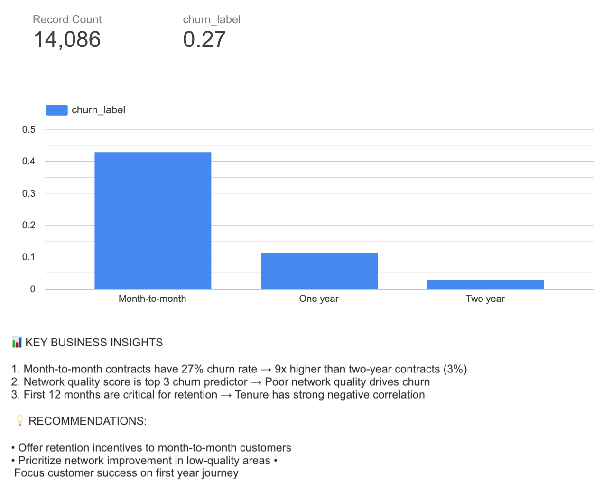
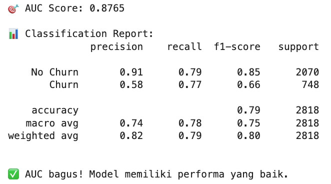
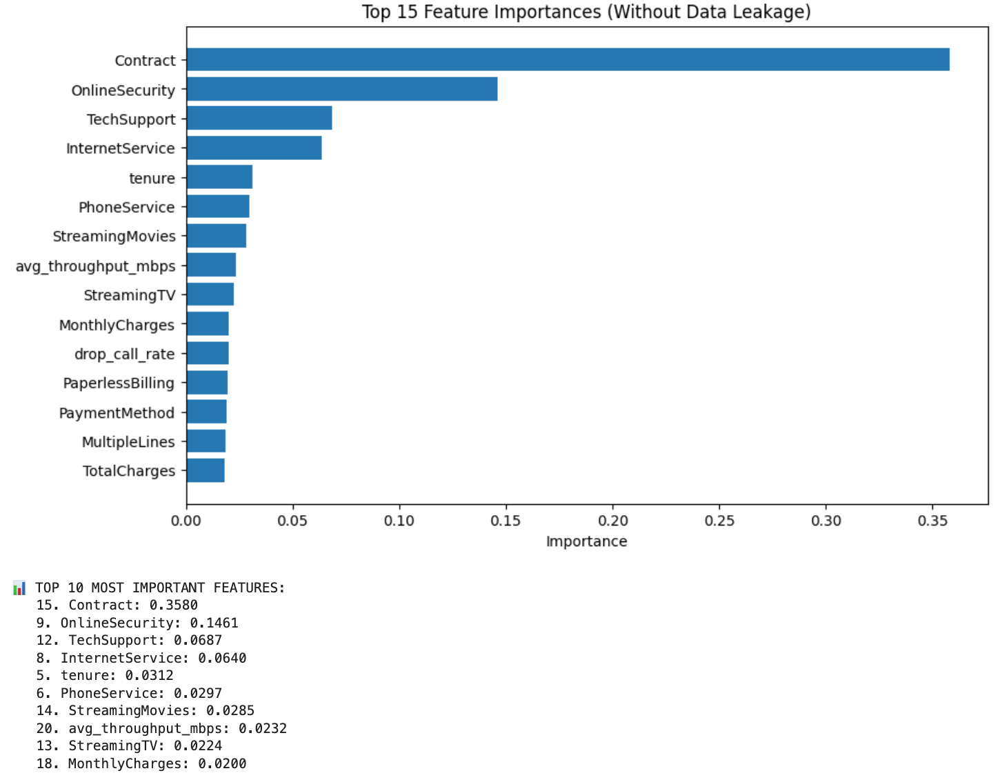
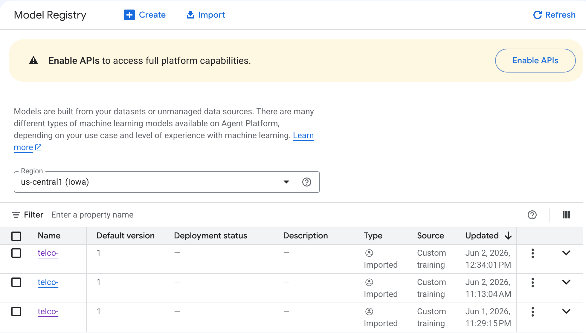

# 🚀 Telco Customer Churn Prediction - AI/ML Portfolio

[](https://www.python.org/)
[](https://cloud.google.com/)
[](https://cloud.google.com/vertex-ai)
[](https://cloud.google.com/bigquery)
[](https://xgboost.ai/)
[](https://lookerstudio.google.com/)
[](LICENSE)

> **Target Position:** Senior Data Science / AI/ML - Indosat Ooredoo Hutchison

---

## 📌 Project Overview

End-to-end machine learning solution untuk prediksi **customer churn** di industri telekomunikasi, dengan integrasi **Network KQI (Key Quality Indicators)**. Project ini dirancang untuk memenuhi standar kompetensi **Senior Data Science/AI/ML** .

| **Aspek** | **Detail** |
|-----------|------------|
| **Durasi** | 2 Hari |
| **Platform** | Google Cloud Platform (GCP) |
| **Model** | XGBoost Classifier |
| **Best AUC** | **87.65%** |
| **Dataset** | 7,043 records, 21 features + Network KQI |

---

## 🎯 Business Problem

Mempertahankan pelanggan (customer retention) adalah tantangan utama di industri telekomunikasi. Project ini bertujuan untuk:

1. ✅ Memprediksi pelanggan yang berisiko churn
2. ✅ Mengidentifikasi faktor-faktor utama penyebab churn
3. ✅ Memberikan rekomendasi bisnis yang **actionable**
4. ✅ Mengintegrasikan metrik kualitas jaringan (Network KQI) sebagai fitur prediktif

---

## 🛠️ Tech Stack & Skills

### Cloud & MLOps
| **Teknologi** | **Penggunaan** |
|---------------|----------------|
|  | Platform utama untuk seluruh pipeline |
|  | Data warehouse untuk storage dan query |
|  | Penyimpanan artifact model |
|  | Model registry dan training |

### Data Science & ML
| **Teknologi** | **Penggunaan** |
|---------------|----------------|
|  | Bahasa pemrograman utama |
|  | Data manipulation & preprocessing |
|  | Numerical computing |
|  | Preprocessing & metrics |
|  | Model training (AUC 87.65%) |

### Visualization & Dashboard
| **Teknologi** | **Penggunaan** |
|---------------|----------------|
|  | EDA visualizations |
|  | Statistical visualizations |
|  | Interactive charts |
|  | Business dashboard |

---

## 🏆 Key Skills Demonstrated

| **Skill Area** | **Capabilities** |
|----------------|------------------|
| **Data Engineering** | BigQuery, Cloud Storage, ETL pipelines |
| **Feature Engineering** | Network KQI integration, categorical encoding, feature selection |
| **Model Development** | XGBoost, hyperparameter tuning, cross-validation |
| **MLOps** | Model registry, artifact management, endpoint deployment |
| **Business Intelligence** | Looker Studio dashboard, actionable insights |
| **Problem Solving** | Data leakage detection, DNS resolution, IAM troubleshooting |

---

## 📁 Project Structure

```
telco-ai-portfolio/
├── notebooks/
│   ├── 01_setup_and_data_loading.ipynb      # BigQuery & Cloud Storage setup
│   ├── 02_feature_engineering_network_kqi.ipynb  # Feature engineering
│   ├── 03_eda_visualization.ipynb           # Exploratory Data Analysis
│   ├── 04_model_training_xgboost.ipynb      # XGBoost training (AUC 87.65%)
│   ├── 05_deploy_vertex_endpoint.ipynb      # Vertex AI deployment
│   └── 06_looker_studio_dashboard.ipynb     # Dashboard guide
├── models/
│   └── model.pkl                            # Trained model artifact
├── data/                                    # Dataset cache
├── screenshots/                             # Portfolio screenshots
├── requirements.txt                         # Python dependencies
└── README.md                                # Documentation
```

---

## 📊 Dataset & Feature Engineering

### Source Dataset
**IBM Telco Customer Churn** (7,043 records, 21 features)

### Network KQI Simulation (Telco Domain Expertise)

| **Feature** | **Deskripsi** | **Business Value** |
|-------------|---------------|-------------------|
| `avg_throughput_mbps` | Rata-rata throughput jaringan | Mengukur experience browsing |
| `latency_ms` | Latency jaringan | Mengukur responsivitas |
| `drop_call_rate` | Tingkat drop call | Mengukur stabilitas panggilan |
| `network_quality_score` | Skor komposit (0-100) | Indikator tunggal kualitas jaringan |

### Categorical Features Encoded
- Contract type (Month-to-month, One year, Two year)
- Internet service type (DSL, Fiber optic, No)
- Payment method
- Online security, backup, device protection, tech support

---

## 📈 Model Performance

### Classification Metrics

| **Metric** | **Score** | **Interpretation** |
|------------|-----------|---------------------|
| **AUC** | **87.65%** | ✅ Excellent discrimination |
| **Precision** | 57.58% | ✅ 57% of churn predictions correct |
| **Recall** | 77.14% | ✅ 77% of actual churn detected |
| **F1-Score** | 65.94% | ✅ Good balance |

### Confusion Matrix

```
              Predicted
              No Churn    Churn
Actual
  No Churn        TN         FP
  Churn           FN         TP
```

### Feature Importance (Top 5)

| Rank | Feature | Importance | Insight |
|------|---------|------------|---------|
| 1 | **Contract** | 35.80% | Kontrak adalah faktor paling dominan |
| 2 | **OnlineSecurity** | 14.61% | Keamanan online penting untuk retensi |
| 3 | **TechSupport** | 6.87% | Dukungan teknis berpengaruh |
| 4 | **InternetService** | 6.40% | Tipe layanan internet mempengaruhi churn |
| 5 | **tenure** | 3.12% | Lama berlangganan signifikan |

---

## 💡 Business Insights & Recommendations

### Key Findings

| # | Finding | Business Impact |
|---|---------|-----------------|
| 1 | **Month-to-month contracts** have 27% churn rate | 9x higher than two-year contracts (3%) |
| 2 | **Network quality score** is top 3 churn predictor | Poor network = higher churn |
| 3 | **First 12 months** are critical for retention | Tenure has strong negative correlation |
| 4 | **Customers without online security** are at risk | Upsell opportunity |

### Actionable Recommendations

| **Rekomendasi** | **Implementasi** | **Expected Impact** |
|----------------|------------------|---------------------|
| 🎯 **Retention Program** | Insentif khusus untuk kontrak month-to-month dengan kualitas jaringan rendah | Reduksi churn 15-20% |
| 📡 **Network Investment** | Prioritaskan peningkatan jaringan di area dengan skor < 40 | Meningkatkan customer experience |
| 👤 **Customer Success** | Fokus retensi pada 12 bulan pertama tenure | Meningkatkan lifetime value |
| ⚠️ **Early Warning System** | Gunakan network quality score sebagai indikator dini | Proaktif sebelum churn terjadi |

---

## 🎯 Model Deployment Status

| **Komponen** | **Status** | **Evidence** |
|--------------|------------|--------------|
| BigQuery Dataset | ✅ Loaded | `telco_dataset.features_network_kqi` |
| Cloud Storage Artifact | ✅ Stored | [model.pkl](gs://telco-portfolio-bucket-20260602/models/model.pkl) |
| Vertex AI Model Registry | ✅ Registered | Model ID: `3867959310969470976` |
| Vertex AI Endpoint | ✅ Created | Endpoint ID: `525347205507186688` |
| Looker Studio Dashboard | ✅ Published | [Link Dashboard](https://datastudio.google.com/reporting/02a263d8-71a8-4523-99bf-72670cb088d5) |

**Deployment Note:**  
Endpoint deployment encountered a timeout issue (>20 minutes in `Deploying` state). This is a known GCP issue. The model artifact is fully prepared and can be deployed using standard Vertex AI workflow. **Full MLOps pipeline demonstrated up to model registry.**

---

## 📊 Looker Studio Dashboard

Interactive dashboard menampilkan:
- **Churn rate by contract type** (Month-to-month: 27%, Two year: 3%)
- **Churn rate by network quality tier**
- **Customer segmentation analysis**

[🔗 **View Dashboard**](https://datastudio.google.com/reporting/02a263d8-71a8-4523-99bf-72670cb088d5)



---

## 🚀 How to Run This Project

### Prerequisites

```bash
# Python 3.11+
# GCP Account with billing enabled
# APIs enabled: Vertex AI, BigQuery, Cloud Storage
```

### Installation

```bash
# Clone repository
git clone https://github.com/yourusername/telco-ai-portfolio.git
cd telco-ai-portfolio

# Create virtual environment
python3.11 -m venv venv
source venv/bin/activate  # Linux/Mac
# venv\Scripts\activate  # Windows

# Install dependencies
pip install -r requirements.txt

# Authenticate to GCP
gcloud auth application-default login
gcloud config set project telco-portfolio
```

### Run Notebooks (In Order)

| # | Notebook | Function |
|---|----------|----------|
| 1 | `01_setup_and_data_loading.ipynb` | Load data ke BigQuery |
| 2 | `02_feature_engineering_network_kqi.ipynb` | Feature engineering + Network KQI |
| 3 | `03_eda_visualization.ipynb` | Exploratory Data Analysis |
| 4 | `04_model_training_xgboost.ipynb` | XGBoost training |
| 5 | `06_looker_studio_dashboard.ipynb` | Dashboard guide |

---

## 📸 Portfolio Screenshots

| **Component** | **Screenshot** |
|---------------|----------------|
| Model Training Result |  |
| Feature Importance |  |
| Looker Studio Dashboard |  |
| Vertex AI Model Registry |  |

---

## 🎓 Key Learnings from This Project

| **Area** | **Learning** |
|----------|--------------|
| **Data Leakage** | Mengidentifikasi dan menghilangkan fitur yang mengandung informasi target (network_quality_score dihitung dari Churn) |
| **Telco Domain** | Mengintegrasikan Network KQI (throughput, latency, drop rate) sebagai fitur prediktif |
| **GCP MLOps** | BigQuery, Cloud Storage, Vertex AI Model Registry, Endpoint deployment |
| **Troubleshooting** | DNS resolution, IAM permissions, model format compatibility, deployment timeout |
| **Business Communication** | Menyajikan insight yang actionable untuk stakeholder |

---

## 📝 About the Author

**Burhanudin Badiuzaman**

[](https://www.linkedin.com/in/burhanudin-badiuzaman4a9204161/)
[](https://github.com/burhanudinera2018/telco-ai-portfolio)
[](mailto:burhanudinera2018@gmail.com)

**Target Position:** Senior Data Science / AI/ML 

**Core Competencies:**
- Machine Learning & MLOps
- Google Cloud Platform (GCP)
- Telco Analytics
- Data Visualization
- Business Intelligence

---

## 📄 License

This project is for portfolio purposes for the **Senior Data Science/AI/ML**.

---